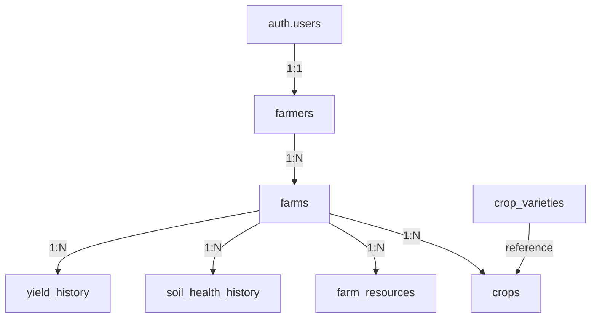

-- database: :memory:
# AgroNavis Supabase Documentation

Welcome to the AgroNavis database documentation. This document provides a detailed overview of the PostgreSQL schema, custom functions, and security policies that power the agricultural management application, all managed by Supabase.

## 🏛️ Core Entities & Relationships

The database is designed around a farmer-centric model for agricultural management. Understanding their relationships is key to understanding the application.

- **`farmers`**: Stores the profile information for registered farmers. This is linked to Supabase's private `auth.users` table.
- **`farms`**: Contains the farm details owned by each farmer. A farmer can have multiple farms.
- **`crops`**: Stores the crop cultivation details for each farm. A farm can have multiple crops across different seasons.
- **`farm_resources`**: Tracks agricultural equipment and resources available on each farm.
- **`soil_health_history`**: Records historical soil test results for each farm.
- **`yield_history`**: Stores historical yield records for crops grown on each farm.
- **`crop_varieties`**: A reference table for common crop varieties and their characteristics.

---

## 📖 Table Reference

This section provides a detailed breakdown of each table in the `public` schema.

### Table: `public.farmers`

Stores farmer profile information linked to authenticated users.

| Column Name         | Data Type     | Constraints & Defaults                  | Description                                                                  |
| :------------------ | :------------ | :-------------------------------------- | :--------------------------------------------------------------------------- |
| `id`                | `uuid`        | `PRIMARY KEY`, `REFERENCES auth.users`  | The farmer's unique ID. References `auth.users.id`.                         |
| `full_name`         | `text`        | `NOT NULL`                              | The farmer's full name.                                                      |
| `phone_number`      | `text`        | `NOT NULL`                              | The farmer's contact phone number.                                           |
| `date_of_birth`     | `date`        | `NULL` allowed                          | The farmer's date of birth.                                                  |
| `gender`            | `text`        | `CHECK (gender IN ('male', 'female', 'other'))` | The farmer's gender.                                         |
| `education_level`   | `text`        | `NULL` allowed                          | The farmer's education level (e.g., 'Primary', 'Secondary', 'Graduate').     |
| `years_of_experience` | `integer`   | `NULL` allowed                          | Number of years of farming experience.                                       |
| `created_at`        | `timestamptz` | `DEFAULT now()`                         | Timestamp when the farmer profile was created.                               |
| `updated_at`        | `timestamptz` | `DEFAULT now()`                         | Timestamp when the farmer profile was last updated.                          |

**Row Level Security (RLS) Policies:**

- **Select Policy:** Users can view only their own farmer profile.
  - `FOR SELECT USING (auth.uid() = id)`
- **Insert Policy:** Users can insert only their own farmer profile.
  - `FOR INSERT WITH CHECK (auth.uid() = id)`
- **Update Policy:** Users can update only their own farmer profile.
  - `FOR UPDATE USING (auth.uid() = id)`

---

### Table: `public.farms`

Stores farm details associated with farmers.

| Column Name       | Data Type     | Constraints & Defaults                                 | Description                                                                 |
| :---------------- | :------------ | :----------------------------------------------------- | :-------------------------------------------------------------------------- |
| `id`              | `uuid`        | `PRIMARY KEY`, `DEFAULT gen_random_uuid()`             | Unique identifier for the farm.                                             |
| `farmer_id`       | `uuid`        | `REFERENCES farmers(id) ON DELETE CASCADE`             | Foreign key referencing the farm owner.                                     |
| `name`            | `text`        | `NOT NULL`                                             | Name of the farm.                                                           |
| `total_area`      | `decimal`     | `NOT NULL`                                             | Total farm area (in acres/hectares).                                        |
| `address`         | `text`        | `NULL` allowed                                         | Physical address of the farm.                                               |
| `location`        | `jsonb`       | `NULL` allowed                                         | Location data: {latitude, longitude, state, district, village}.             |
| `soil_type`       | `text`        | `CHECK (soil_type IN ('sandy', 'clay', 'loamy', 'silt', 'peaty', 'chalky'))` | Type of soil on the farm.                            |
| `irrigation_type` | `text`        | `CHECK (irrigation_type IN ('drip', 'sprinkler', 'flood', 'rainfed', 'manual'))` | Irrigation method used.                                  |
| `ownership_type`  | `text`        | `CHECK (ownership_type IN ('owned', 'leased', 'shared'))` | Ownership type of the farm.                                              |
| `created_at`      | `timestamptz` | `DEFAULT now()`                                        | Timestamp when the farm record was created.                                 |

**Row Level Security (RLS) Policies:**

- **Select Policy:** Farmers can view only their own farms.
  - `FOR SELECT USING (auth.uid() = farmer_id)`
- **Insert Policy:** Farmers can insert only for themselves.
  - `FOR INSERT WITH CHECK (auth.uid() = farmer_id)`
- **Update Policy:** Farmers can update only their own farms.
  - `FOR UPDATE USING (auth.uid() = farmer_id)`
- **Delete Policy:** Farmers can delete only their own farms.
  - `FOR DELETE USING (auth.uid() = farmer_id)`

---

### Table: `public.crops`

Tracks crop cultivation details for each farm.

| Column Name             | Data Type     | Constraints & Defaults                                 | Description                                                                 |
| :---------------------- | :------------ | :----------------------------------------------------- | :-------------------------------------------------------------------------- |
| `id`                    | `uuid`        | `PRIMARY KEY`, `DEFAULT gen_random_uuid()`             | Unique identifier for the crop record.                                      |
| `farm_id`               | `uuid`        | `REFERENCES farms(id) ON DELETE CASCADE`               | Foreign key referencing the farm.                                           |
| `crop_type`             | `text`        | `NOT NULL`                                             | Type of crop (e.g., 'Rice', 'Wheat', 'Cotton').                             |
| `variety`               | `text`        | `NULL` allowed                                         | Specific variety of the crop.                                               |
| `sowing_date`           | `date`        | `NULL` allowed                                         | Date when the crop was sown.                                                |
| `expected_harvest_date` | `date`        | `NULL` allowed                                         | Expected harvest date.                                                      |
| `area_allocated`        | `decimal`     | `NOT NULL`                                             | Area allocated for this crop (in acres/hectares).                           |
| `season`                | `text`        | `CHECK (season IN ('kharif', 'rabi', 'zaid', 'perennial'))` | Agricultural season.                                             |
| `current_growth_stage`  | `text`        | `CHECK (current_growth_stage IN ('sowing', 'germination', 'vegetative', 'flowering', 'fruiting', 'harvesting'))` | Current growth stage. |
| `yield_expectation`     | `decimal`     | `NULL` allowed                                         | Expected yield quantity.                                                    |
| `created_at`            | `timestamptz` | `DEFAULT now()`                                        | Timestamp when the crop record was created.                                 |

**Row Level Security (RLS) Policies:**

- **Select Policy:** Farmers can view crops only on their own farms.
  - `FOR SELECT USING (auth.uid() IN (SELECT farmer_id FROM farms WHERE id = farm_id))`
- **Insert Policy:** Farmers can insert crops only on their own farms.
  - `FOR INSERT WITH CHECK (auth.uid() IN (SELECT farmer_id FROM farms WHERE id = farm_id))`
- **Update Policy:** Farmers can update crops only on their own farms.
  - `FOR UPDATE USING (auth.uid() IN (SELECT farmer_id FROM farms WHERE id = farm_id))`
- **Delete Policy:** Farmers can delete crops only from their own farms.
  - `FOR DELETE USING (auth.uid() IN (SELECT farmer_id FROM farms WHERE id = farm_id))`

---

### Table: `public.farm_resources`

Tracks agricultural equipment and resources on each farm.

| Column Name      | Data Type     | Constraints & Defaults                                 | Description                                                                 |
| :--------------- | :------------ | :----------------------------------------------------- | :-------------------------------------------------------------------------- |
| `id`             | `uuid`        | `PRIMARY KEY`, `DEFAULT gen_random_uuid()`             | Unique identifier for the resource.                                         |
| `farm_id`        | `uuid`        | `REFERENCES farms(id) ON DELETE CASCADE`               | Foreign key referencing the farm.                                           |
| `resource_type`  | `text`        | `CHECK (resource_type IN ('tractor', 'harvester', 'plough', 'irrigation_pump', 'sprayer', 'storage'))` | Type of resource. |
| `quantity`       | `integer`     | `DEFAULT 1`                                            | Number of units available.                                                  |
| `condition`      | `text`        | `CHECK (condition IN ('excellent', 'good', 'average', 'poor'))` | Condition of the resource.                                  |
| `created_at`     | `timestamptz` | `DEFAULT now()`                                        | Timestamp when the resource record was created.                             |

**Row Level Security (RLS) Policies:**

- **Select Policy:** Farmers can view resources only on their own farms.
  - `FOR SELECT USING (auth.uid() IN (SELECT farmer_id FROM farms WHERE id = farm_id))`
- **Insert Policy:** Farmers can insert resources only on their own farms.
  - `FOR INSERT WITH CHECK (auth.uid() IN (SELECT farmer_id FROM farms WHERE id = farm_id))`
- **Update Policy:** Farmers can update resources only on their own farms.
  - `FOR UPDATE USING (auth.uid() IN (SELECT farmer_id FROM farms WHERE id = farm_id))`
- **Delete Policy:** Farmers can delete resources only from their own farms.
  - `FOR DELETE USING (auth.uid() IN (SELECT farmer_id FROM farms WHERE id = farm_id))`

---

### Table: `public.soil_health_history`

Records historical soil test results for farms.

| Column Name       | Data Type     | Constraints & Defaults                  | Description                                                     |
| :---------------- | :------------ | :-------------------------------------- | :-------------------------------------------------------------- |
| `id`              | `uuid`        | `PRIMARY KEY`, `DEFAULT gen_random_uuid()` | Unique identifier for the soil test record.                 |
| `farm_id`         | `uuid`        | `REFERENCES farms(id) ON DELETE CASCADE` | Foreign key referencing the farm.                           |
| `ph_level`        | `decimal`     | `NULL` allowed                          | Soil pH level.                                                  |
| `nitrogen`        | `decimal`     | `NULL` allowed                          | Nitrogen content (in kg/ha or ppm).                            |
| `phosphorus`      | `decimal`     | `NULL` allowed                          | Phosphorus content (in kg/ha or ppm).                          |
| `potassium`       | `decimal`     | `NULL` allowed                          | Potassium content (in kg/ha or ppm).                           |
| `organic_carbon`  | `decimal`     | `NULL` allowed                          | Organic carbon content (in %).                                 |
| `moisture_level`  | `decimal`     | `NULL` allowed                          | Soil moisture level (in %).                                    |
| `tested_date`     | `date`        | `DEFAULT CURRENT_DATE`                  | Date when the soil test was conducted.                         |
| `created_at`      | `timestamptz` | `DEFAULT now()`                         | Timestamp when the record was created.                         |

**Row Level Security (RLS) Policies:**

- **Select Policy:** Farmers can view soil health records only for their own farms.
  - `FOR SELECT USING (auth.uid() IN (SELECT farmer_id FROM farms WHERE id = farm_id))`
- **Insert Policy:** Farmers can insert soil health records only for their own farms.
  - `FOR INSERT WITH CHECK (auth.uid() IN (SELECT farmer_id FROM farms WHERE id = farm_id))`

---

### Table: `public.yield_history`

Stores historical crop yield records for farms.

| Column Name     | Data Type     | Constraints & Defaults                  | Description                                                     |
| :-------------- | :------------ | :-------------------------------------- | :-------------------------------------------------------------- |
| `id`            | `uuid`        | `PRIMARY KEY`, `DEFAULT gen_random_uuid()` | Unique identifier for the yield record.                     |
| `farm_id`       | `uuid`        | `REFERENCES farms(id) ON DELETE CASCADE` | Foreign key referencing the farm.                           |
| `crop_type`     | `text`        | `NOT NULL`                              | Type of crop harvested.                                         |
| `variety`       | `text`        | `NULL` allowed                          | Variety of crop harvested.                                      |
| `season`        | `text`        | `NULL` allowed                          | Agricultural season.                                            |
| `year`          | `integer`     | `NOT NULL`                              | Year of harvest.                                                |
| `quantity`      | `decimal`     | `NOT NULL`                              | Yield quantity.                                                 |
| `unit`          | `text`        | `DEFAULT 'kg'`                          | Unit of measurement (default: kilograms).                      |
| `quality_notes` | `text`        | `NULL` allowed                          | Notes on crop quality.                                          |
| `created_at`    | `timestamptz` | `DEFAULT now()`                         | Timestamp when the record was created.                         |

**Row Level Security (RLS) Policies:**

- **Select Policy:** Farmers can view yield history only for their own farms.
  - `FOR SELECT USING (auth.uid() IN (SELECT farmer_id FROM farms WHERE id = farm_id))`
- **Insert Policy:** Farmers can insert yield records only for their own farms.
  - `FOR INSERT WITH CHECK (auth.uid() IN (SELECT farmer_id FROM farms WHERE id = farm_id))`

---

### Table: `public.crop_varieties`

Reference table for common crop varieties and their characteristics.

| Column Name           | Data Type     | Constraints & Defaults                  | Description                                                     |
| :-------------------- | :------------ | :-------------------------------------- | :-------------------------------------------------------------- |
| `id`                  | `uuid`        | `PRIMARY KEY`, `DEFAULT gen_random_uuid()` | Unique identifier for the variety record.                   |
| `crop_type`           | `text`        | `NOT NULL`                              | Type of crop.                                                   |
| `variety`             | `text`        | `NOT NULL`                              | Name of the variety.                                            |
| `season`              | `text[]`      | `NOT NULL`                              | Array of applicable seasons (e.g., ['kharif']).                 |
| `avg_yield_per_acre`  | `decimal`     | `NULL` allowed                          | Average yield per acre for this variety.                        |
| `growth_duration_days`| `integer`     | `NULL` allowed                          | Typical growth duration in days.                                |
| `created_at`          | `timestamptz` | `DEFAULT now()`                         | Timestamp when the record was created.                         |

**Row Level Security (RLS) Policies:**

- **Select Policy:** All authenticated users can view crop varieties.
  - `FOR SELECT TO authenticated USING (true)`

---

## 🚀 Database Functions

### Function: `update_updated_at_column()`

- **Purpose:** Updates the `updated_at` column with the current timestamp whenever a row is updated in the `farmers` table.
- **Arguments:** None.
- **Return Value:** Returns the modified `NEW` row.
- **Usage:** This function is used as a trigger function to automatically maintain update timestamps.

---

## 🔄 Triggers

### Trigger: `update_farmers_updated_at`

- **Purpose:** Automatically updates the `updated_at` column in the `farmers` table before each update operation.
- **When:** `BEFORE UPDATE` on the `farmers` table.
- **For Each Row:** Yes.
- **Function:** Calls `update_updated_at_column()`.

---

## 📊 Indexes

The following indexes are created for optimal query performance:

1. **`idx_farmers_id`** on `farmers(id)` - Primary key index.
2. **`idx_farms_farmer_id`** on `farms(farmer_id)` - Speeds up farmer-specific farm queries.
3. **`idx_crops_farm_id`** on `crops(farm_id)` - Optimizes crop queries by farm.
4. **`idx_farm_resources_farm_id`** on `farm_resources(farm_id)` - Optimizes resource queries by farm.
5. **`idx_soil_health_farm_id`** on `soil_health_history(farm_id)` - Speeds up soil health history queries.
6. **`idx_yield_history_farm_id`** on `yield_history(farm_id)` - Optimizes yield history queries.
7. **`idx_crops_type_season`** on `crops(crop_type, season)` - Supports crop type and season-based queries.
8. **`idx_yield_history_year`** on `yield_history(year)` - Optimizes queries filtering by year.

---

## 🌱 Sample Crop Varieties

The database includes reference data for common crop varieties:

| Crop Type  | Variety     | Seasons       | Avg Yield/Acre | Growth Duration |
| :--------- | :---------- | :------------ | :------------- | :-------------- |
| Rice       | Basmati     | kharif        | 25.0           | 120 days        |
| Rice       | IR64        | kharif        | 30.0           | 110 days        |
| Wheat      | HD2967      | rabi          | 35.0           | 120 days        |
| Wheat      | PBW343      | rabi          | 32.0           | 125 days        |
| Cotton     | Bt Cotton   | kharif        | 20.0           | 180 days        |
| Sugarcane  | Co238       | perennial     | 400.0          | 365 days        |
| Maize      | Pioneer     | kharif, rabi  | 40.0           | 90 days         |
| Soybean    | JS335       | kharif        | 15.0           | 100 days        |

---

## 🔒 Security Summary

All tables have Row Level Security (RLS) enabled with the following access patterns:

- **Farmer Data Isolation:** Each farmer can only access their own data and the data associated with their farms.
- **Reference Data:** The `crop_varieties` table is readable by all authenticated users for selection purposes.
- **Cascading Deletes:** Farm deletion cascades to all related data (crops, resources, soil history, yield history).
- **No Anonymous Access:** All data requires authentication except for `crop_varieties` which is read-only for authenticated users.

---

## 📈 Data Relationships

- Each **farmer** can have multiple **farms**
- Each **farm** can have multiple **crops**, **resources**, **soil tests**, and **yield records**
- **Crop varieties** serve as reference data for crop selection
- All data is scoped to the authenticated farmer's ownership